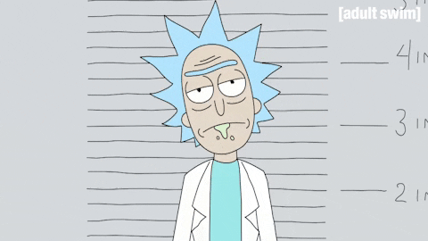

## Ahmed Nassar - @ranger163
### Welcome to "THE" profile :mask: 👋
#### Always code as if the guy who ends up maintaining your code will be a violent psychopath who knows where you live.

<p align="center">
  
</p>


```kotlin
object Nassar {
 val name = "Ahmed Nassar"
 val title = "Senior Software Engineer"
 
 val primarySkillset = "Android"
 val otherSkillset = "SpringBoot, Flutter, Ktor Server Framework, Kotlin Multiplatform Mobile"
 val languages = listOf("Kotlin", "Java", "Dart", "Angular")

 val website = "https://www.inassar.me"
 val contact = "@ranger163".apply {
   twitter = this
   linkedin = this
   instagram = "${this}94"
   email = "ahmed.nassar163@gmail.com"
 }

}
```
---

<p align="center">
    <a href="https://github.com/ranger163"></a>
    <a href="https://github.com/ranger163"></a>
</p>

<p align="center">
    <a href="https://github.com/ranger163?tab=followers"></a>
    <a href="https://twitter.com/ranger163"></a>
</p>
<p align="center">
    <a href="https://github.com/ranger163"></a>
</p>

## Having some thoughts? 
### Contact me here or follow me on twitter I tweet about tech stuff and share cat memes all the time.
[](mailto:ahmed.nassar163@gmail.com)
[](https://instagram.com/ranger16394)
[](https://twitter.com/ranger163)
[](https://linkedin.com/in/ranger163)
<br>
